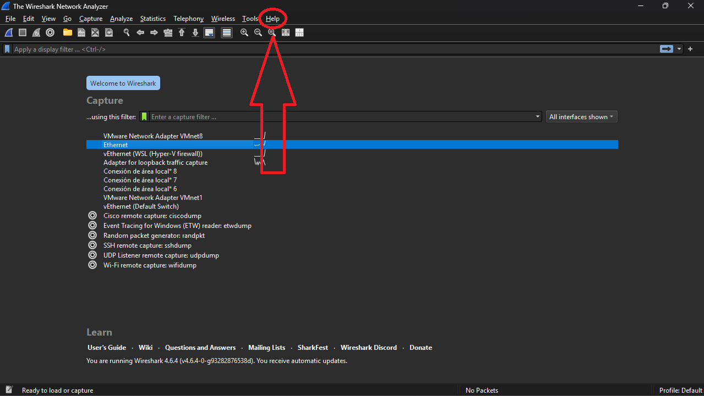
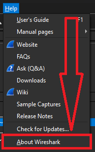
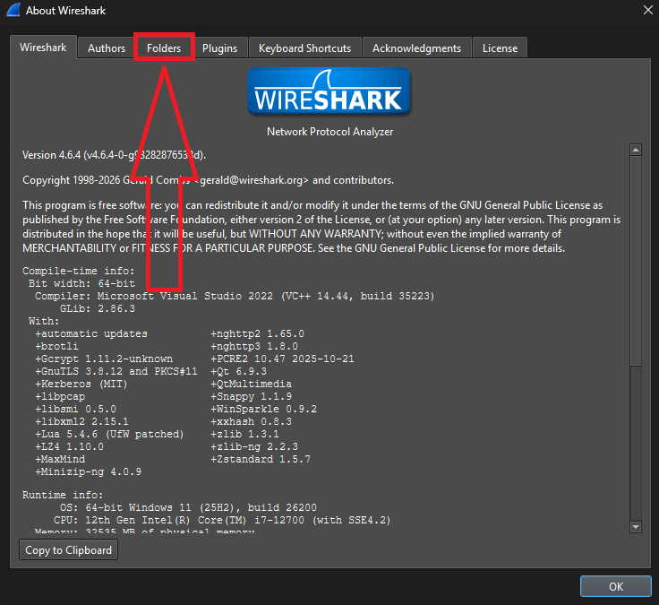
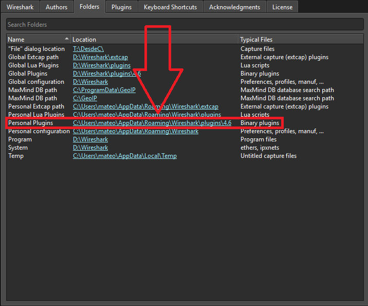
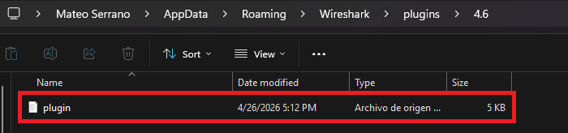
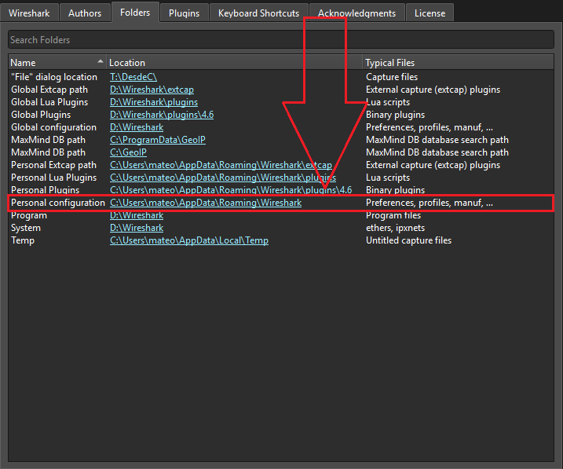
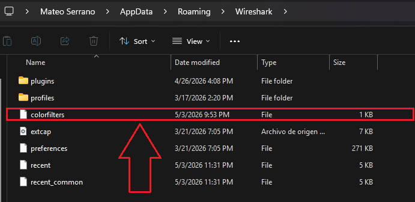
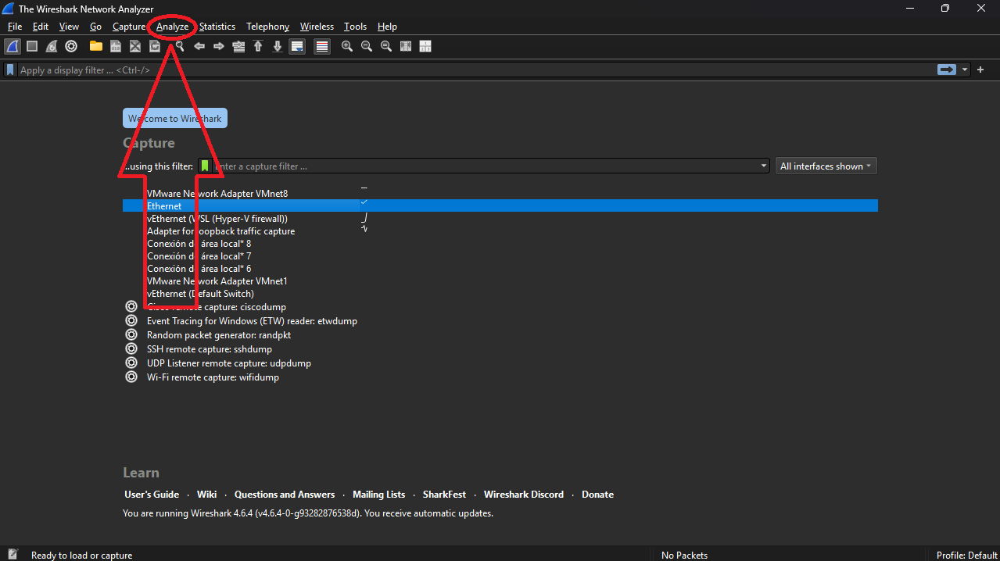
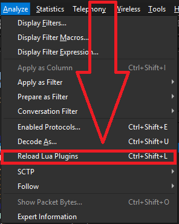

# Plugin de Wireshark

Para este trabajo, se implementó un script en Lua para agregar como plugin de Wireshark,
que permite interpretar el protocolo desarrollado, y un archivo de colores para una vista
más amigable.

Para *instalarlos*, manualmente, se debe seguir los siguientes pasos:

### Paso 1. Abrir Wireshark y tocar el botón de `Ayuda` o `Help`

### Paso 2. Abrir la sección `Acerca de Wireshark` o `About Wireshark`

### Paso 3. Abrir la sección `Carpetas` o `Folders`

## Instalación del plugin

### Paso 4.1. Abrir la carpeta `Plugins/Extensiones personales` o `Personal plugins`

### Paso 5.1. Pegar el [`plugin`](plugin.lua), de esta misma carpeta, en la carpeta que se abre

## Instalación de los colores

### Paso 4.2. Abrir la carpeta `Configuración personal` o `Personal config`

### Paso 5.2. Pegar el [`colorfilters`](colorfilters.lua), de esta misma carpeta, en la carpeta que se abre

> [!IMPORTANT]
> El archivo debe llamarse exactamente `colorfilters`

### Paso 6. Refrescar los plugins de Wireshark con `Ctrl` + `Shift` + `L`, o tocando la
### opción `Analizar` o `Analyze`

### Y seleccionar la opción `Recargar plugins/extensiones de Lua` o `Reload Lua Plugins`

## Verificar el ejemplo

En esta misma carpeta se encuentra un archivo `test.py` que genera un archivo `test_rfto.pcap`
en el root del proyecto, que sirve para simular paquetes y visualizarlos en Wireshark.

Puede modificarse el archivo si se conoce en profundidad el protocolo, y correrlo para
generar un nuevo ejemplo, o puede simplemente utilizarse el ejemplo proporcionado abriéndolo
con Wireshark.
